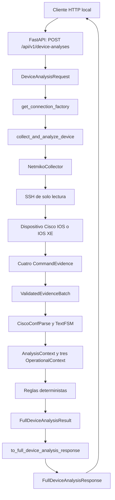
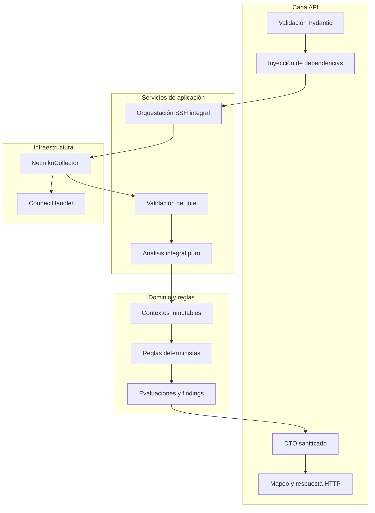
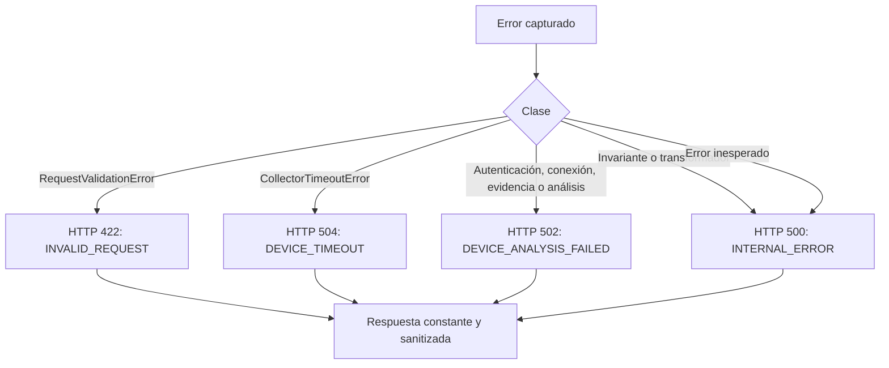

# Registro técnico del Incremento 7: API para análisis integral de dispositivos

## 1. Identificación del incremento

| Elemento | Valor |
|---|---|
| Nombre oficial | Incremento 7 — API FastAPI para análisis integral SSH de solo lectura |
| Rama funcional | `feature/full-device-api` |
| Contratos API seguros | `fbd2112` — `feat: add safe full device API contracts` |
| Endpoint funcional | `91aba97` — `feat: expose safe full device analysis API` |
| Endpoint | `POST /api/v1/device-analyses` |
| Modalidad | Síncrona, sin persistencia y exclusivamente de lectura |
| Resultado | Respuesta HTTP tipada y sanitizada mediante `FullDeviceAnalysisResponse` |

Este documento registra la exposición segura, mediante FastAPI, del análisis integral construido en el Incremento 6. El endpoint recibe parámetros mínimos de conexión, ejecuta una auditoría determinista de un dispositivo Cisco IOS o IOS XE y devuelve únicamente información autorizada. La API no permite seleccionar comandos, no modifica el dispositivo y no utiliza inteligencia artificial para decidir resultados técnicos.

## 2. Situación inicial

Al comenzar el Incremento 7, el proyecto ya podía:

- abrir una única sesión SSH de solo lectura mediante `NetmikoCollector`;
- recopilar cuatro comandos canónicos en orden;
- construir y validar cuatro objetos `CommandEvidence` con un `execution_id` común;
- analizar `show running-config` mediante `ciscoconfparse2` y `CiscoConfParse`;
- analizar tres comandos operacionales mediante TextFSM;
- construir tres objetos `OperationalContext`;
- ejecutar tres reglas de configuración y `IOS-IF-001`;
- producir un `FullDeviceAnalysisResult` inmutable y trazable;
- conservar todas las evaluaciones y derivar findings exclusivamente de `FAIL`.

La suite contenía 197 pruebas al cierre del Incremento 6. Sin embargo, FastAPI solo exponía el análisis de archivos locales. No existían un contrato HTTP para credenciales transitorias, un DTO seguro para el resultado integral, una dependencia reemplazable para la fábrica SSH ni una política HTTP específica para errores de dispositivo.

## 3. Motivación

El servicio integral era utilizable desde Python, pero todavía no constituía una interfaz de aplicación consumible por otras capas. Exponer directamente `FullDeviceAnalysisResult` habría sido inseguro porque el contrato de dominio conserva evidencias completas, host lógico, salidas originales, salidas normalizadas y contextos operacionales.

El incremento debía resolver simultáneamente cuatro problemas:

1. definir una entrada HTTP estricta y mínima;
2. evitar que FastAPI serializara datos internos o credenciales;
3. traducir fallos técnicos a respuestas públicas constantes y sanitizadas;
4. conservar la arquitectura de solo lectura y la capacidad de probar sin red.

## 4. Objetivo general

Exponer el análisis integral de un dispositivo mediante un endpoint FastAPI local, síncrono, tipado y seguro, reutilizando el flujo determinista existente y sin permitir que el cliente controle comandos, parámetros internos del collector o decisiones técnicas.

## 5. Objetivos específicos

- Validar host, puerto, usuario y contraseña mediante Pydantic.
- Aceptar únicamente direcciones IPv4 privadas RFC 1918 conforme a la política del MVP.
- Representar la contraseña mediante `SecretStr`.
- Prohibir campos adicionales.
- Inyectar la fábrica de conexión mediante `Depends`.
- Invocar `collect_and_analyze_device()` exactamente una vez.
- Transformar el resultado de dominio mediante mapeo explícito.
- Excluir parámetros de conexión, salidas completas y contextos internos.
- Sanitizar respuestas 422, 500, 502 y 504.
- Mantener los endpoints anteriores y su contrato `MISSING_FILE`.
- Probar el endpoint sin sockets ni conexiones SSH reales.
- Conservar compatibilidad con futuras reglas y cantidades variables de evaluaciones.

## 6. Alcance implementado

El incremento incluye:

- `DeviceAnalysisRequest` como contrato de solicitud;
- `CommandEvidenceMetadataResponse` como vista mínima de evidencia;
- `FullDeviceAnalysisResponse` como DTO de respuesta;
- `to_full_device_analysis_response()` como transformador puro y explícito;
- `get_connection_factory()` como dependencia reemplazable;
- `POST /api/v1/device-analyses` con respuesta 200;
- respuesta 422 global sanitizada;
- mapeo por clases reales a HTTP 500, 502 y 504;
- OpenAPI con los modelos de solicitud y respuesta;
- 37 casos de contratos y serialización;
- 31 casos de integración HTTP;
- validación manual local mediante Uvicorn en loopback;
- validación real extremo a extremo contra el equipo virtual autorizado.

## 7. Fuera de alcance

No se implementaron:

- persistencia en PostgreSQL;
- SQLAlchemy o Alembic;
- autenticación de usuarios de la API;
- almacenamiento de credenciales;
- Streamlit;
- pasarela de inteligencia artificial;
- nuevos comandos `show`;
- nuevas reglas técnicas;
- ejecución asíncrona o en segundo plano;
- análisis simultáneo de múltiples dispositivos;
- endpoints para comandos arbitrarios;
- cambios automáticos sobre dispositivos;
- exposición del servidor fuera de loopback durante la validación.

## 8. Estado previo del sistema

El Incremento 6 entregaba esta API pública de aplicación:

```python
def collect_and_analyze_device(
    *,
    host: str,
    port: int,
    username: str,
    password: str,
    connection_factory: ConnectionFactory | None = None,
) -> FullDeviceAnalysisResult:
    ...
```

La función ya controlaba una única sesión, generaba el UUID de ejecución, solicitaba el lote canónico, validaba las evidencias y delegaba el análisis. El Incremento 7 no cambió esa firma ni duplicó sus responsabilidades.

## 9. Arquitectura resultante

La arquitectura agrega una capa HTTP sobre el servicio integral sin entregar FastAPI, Pydantic ni credenciales a los collectors, parsers o reglas.



## 10. Flujo integral real de la solicitud

1. FastAPI valida el cuerpo mediante `DeviceAnalysisRequest`.
2. `Depends(get_connection_factory)` obtiene la fábrica de producción o una sustitución de prueba.
3. La contraseña se revela desde `SecretStr` solamente en el argumento inmediato del servicio.
4. `collect_and_analyze_device()` crea el collector y genera un único `execution_id`.
5. `NetmikoCollector.collect()` abre una sesión y ejecuta los cuatro comandos canónicos.
6. La sesión se cierra mediante `disconnect()`.
7. `validate_evidence_batch()` comprueba cardinalidad, orden, UUID, UTC, normalización y SHA-256.
8. `analyze_validated_evidence_batch()` reutiliza los parsers y las reglas existentes.
9. Se construye `FullDeviceAnalysisResult`.
10. `to_full_device_analysis_response()` verifica las invariantes de exposición.
11. FastAPI serializa exclusivamente `FullDeviceAnalysisResponse`.

La ausencia de findings no se utiliza para inferir el éxito del procesamiento ni para afirmar que todas las reglas produjeron `PASS`.

## 11. Separación de responsabilidades



## 12. Contrato HTTP del endpoint

| Propiedad | Valor |
|---|---|
| Método | `POST` |
| Ruta | `/api/v1/device-analyses` |
| Entrada | `DeviceAnalysisRequest` |
| Respuesta exitosa | `FullDeviceAnalysisResponse` |
| Código exitoso | `200 OK` |
| Ejecución | Síncrona |
| Persistencia | No |
| Comandos del cliente | No admitidos |

Firma implementada:

```python
def create_device_analysis(
    request: DeviceAnalysisRequest,
    connection_factory: ConnectionFactory = Depends(get_connection_factory),
) -> FullDeviceAnalysisResponse:
    ...
```

## 13. Modelo de solicitud

| Campo | Tipo y restricción | Tratamiento |
|---|---|---|
| `host` | Literal IPv4 dentro de RFC 1918 | Se convierte a texto solo al llamar al servicio |
| `port` | Entero estricto entre 1 y 65535 | No admite coerción desde valores incompatibles |
| `username` | Texto no vacío, máximo 128 caracteres | Rechaza espacios periféricos y caracteres de control |
| `password` | `SecretStr`, no vacío, máximo 1024 caracteres | Se revela solo en el límite inmediato del servicio |

`DeviceAnalysisRequest` hereda `extra="forbid"`. La política conservadora del MVP también excluye direcciones terminadas en `.0` o `.255`. Esta exclusión no afirma que tales direcciones sean universalmente red o broadcast: esa clasificación depende del prefijo o máscara, que el contrato no recibe.

## 14. Modelo de respuesta

`FullDeviceAnalysisResponse` expone:

- `execution_id`;
- cuatro elementos `CommandEvidenceMetadataResponse`;
- `operational_context_count`;
- lista completa de `rule_evaluations`;
- lista completa de `findings`;
- `total_evaluations`;
- `total_findings`;
- `status_summary` con claves `RuleStatus`;
- `finding_severity_summary` con claves `Severity`.

Cada evidencia pública contiene únicamente:

| Campo | Propósito |
|---|---|
| `command` | Identificar la fuente canónica |
| `collected_at` | Conservar la fecha UTC de recopilación |
| `raw_output_sha256` | Comprobar la identidad de la salida original sin exponerla |

## 15. Datos excluidos de la respuesta

El DTO no contiene:

- `host` ni `device_host`;
- `username` ni `password`;
- `raw_output`;
- `normalized_output`;
- configuración completa;
- objetos `OperationalContext` completos;
- `configuration_result` interno;
- objetos de conexión;
- parámetros Netmiko;
- cuerpo de la solicitud.

Las evaluaciones y findings reutilizan contratos previamente revisados. Sus evidencias actuales son fragmentos controlados por reglas: `enable password` se redacta completamente y la regla operacional construye evidencia estructurada sin salida completa.

## 16. Restricciones y campos rechazados

El cliente no puede enviar ni controlar:

- `command`;
- `commands`;
- `timeout`;
- `device_type`;
- listas de comandos;
- parámetros de Netmiko;
- opciones de parsing;
- reglas por ejecutar.

Los cuatro comandos son responsabilidad del servicio y permanecen definidos en `CANONICAL_EVIDENCE_COMMANDS`:

1. `show running-config`;
2. `show version`;
3. `show ip interface brief`;
4. `show ip ssh`.

## 17. Integración con el servicio integral

El endpoint realiza una única llamada a `collect_and_analyze_device()`. Entrega host, puerto, usuario, contraseña revelada desde `SecretStr` y la fábrica inyectada. No llama directamente al collector, no genera UUID, no recopila comandos por separado y no ejecuta parsers o reglas.

Esta decisión impide crear un segundo flujo de análisis dentro de la API y conserva las pruebas e invariantes del Incremento 6.

## 18. Inyección de dependencias

`get_connection_factory()` se encuentra en `src/ios_auditor/api/dependencies.py` y devuelve `ConnectHandler` en producción. FastAPI la incorpora mediante `Depends`.

En pruebas, `app.dependency_overrides[get_connection_factory]` entrega una fábrica `MagicMock`. De este modo se comprueban parámetros, conexión, comandos y desconexión sin abrir sockets. Cada fixture elimina sus overrides al finalizar.

## 19. Transformación segura de resultados

`to_full_device_analysis_response()` es una función pura con la firma:

```python
def to_full_device_analysis_response(
    result: FullDeviceAnalysisResult,
) -> FullDeviceAnalysisResponse:
    ...
```

La función no usa `to_primitive()` sobre el resultado integral. Mapea cada campo permitido explícitamente y valida:

- tipo de resultado;
- existencia de cuatro evidencias;
- orden de comandos canónicos;
- tipo `CommandEvidence`;
- `execution_id` común;
- correspondencia exacta entre evaluaciones `FAIL` y findings.

La cantidad de evaluaciones no está fijada en cuatro. Una prueba agrega una evaluación futura y confirma que el DTO la conserva junto con su resumen, sin generar un finding para un estado `ERROR`.

## 20. Manejo y sanitización de errores

La API clasifica fallos por sus clases, nunca por el texto de la excepción. No utiliza `str(exc)`, `repr(exc)`, `exc.args`, `detail=str(exc)` ni mensajes provenientes de Netmiko, Paramiko o los parsers.

La respuesta 422 general es:

```json
{
  "error": {
    "code": "INVALID_REQUEST",
    "message": "La solicitud no es válida."
  }
}
```

El manejador no devuelve `RequestValidationError.errors()`, `exc.body`, `input`, `ctx` ni valores recibidos. Solo inspecciona metadatos estructurales para conservar el caso histórico `MISSING_FILE` del endpoint de archivos.

El manejador global de errores inesperados registra método, ruta y nombre de clase. Usa `logger.error()` sin traceback ni mensaje interno, por lo que no incorpora parámetros de conexión o contenido de excepciones.

## 21. Tabla de códigos HTTP y códigos públicos

| Condición | Clase principal | HTTP | Código público | Mensaje público |
|---|---|---:|---|---|
| Solicitud inválida | `RequestValidationError` | 422 | `INVALID_REQUEST` | `La solicitud no es válida.` |
| Timeout SSH | `CollectorTimeoutError` | 504 | `DEVICE_TIMEOUT` | `El dispositivo no respondió dentro del tiempo permitido.` |
| Autenticación del dispositivo | `CollectorAuthenticationError` | 502 | `DEVICE_ANALYSIS_FAILED` | `No fue posible completar el análisis del dispositivo.` |
| Conexión o comando | `CollectorConnectionError` | 502 | `DEVICE_ANALYSIS_FAILED` | `No fue posible completar el análisis del dispositivo.` |
| Lote de evidencias inválido | `EvidenceBatchValidationError` | 502 | `DEVICE_ANALYSIS_FAILED` | `No fue posible completar el análisis del dispositivo.` |
| Parsing operacional | `OperationalAnalysisError` | 502 | `DEVICE_ANALYSIS_FAILED` | `No fue posible completar el análisis del dispositivo.` |
| Análisis de entrada del dispositivo | `AnalysisError` | 502 | `DEVICE_ANALYSIS_FAILED` | `No fue posible completar el análisis del dispositivo.` |
| Comando canónico interno inconsistente | `CommandNotAllowedError` | 500 | `INTERNAL_ERROR` | `Ocurrió un error interno inesperado.` |
| Invariante integral | `FullDeviceAnalysisContractError` | 500 | `INTERNAL_ERROR` | `Ocurrió un error interno inesperado.` |
| Transformación segura | `FullDeviceResponseContractError` | 500 | `INTERNAL_ERROR` | `Ocurrió un error interno inesperado.` |
| Error inesperado | `Exception` | 500 | `INTERNAL_ERROR` | `Ocurrió un error interno inesperado.` |

La autenticación SSH del dispositivo produce 502 y no 401, porque no representa autenticación del consumidor de la API.



## 22. Protección de credenciales

- La contraseña se modela como `SecretStr`.
- `get_secret_value()` aparece una sola vez en producción y solo al invocar el servicio.
- El modelo de solicitud no se convierte a `dict` ni se serializa para logs o errores.
- La API utiliza el usuario y la contraseña únicamente como datos transitorios para invocar el servicio de conexión. No los persiste, registra, serializa ni devuelve. Debido a que Python no garantiza el borrado físico inmediato de cadenas en memoria, el control aplicado consiste en minimizar su tiempo de vida y evitar copias innecesarias.
- La API no persiste credenciales.
- Los logs contienen método, ruta, estado y metadatos no sensibles.
- Las pruebas usan valores sintéticos.
- Las respuestas 200, 422, 500, 502 y 504 se comprueban contra marcadores sensibles ficticios.

Pydantic puede conservar el valor original de una entrada inválida dentro de `ValidationError.errors()`. Por ello, la API no devuelve esa estructura predeterminada y utiliza un mensaje 422 fijo.

## 23. Garantía de solo lectura

El endpoint reutiliza la lista blanca y el collector del Incremento 6. El cliente no puede modificar la lista ni enviar comandos. El flujo usa `send_command()` para consultas y no llama a:

- `send_config_set()`;
- `config_mode()`;
- `enable()`;
- `configure terminal`;
- comandos de escritura, reinicio o borrado.

La conexión se cierra mediante `disconnect()` incluso cuando ocurre un fallo después de crear la sesión. La API no aplica recomendaciones ni puede alterar la configuración del dispositivo.

## 24. Compatibilidad con endpoints anteriores

Continúan disponibles:

- `GET /health`;
- `GET /api/v1/rules`;
- `POST /api/v1/analyses`;
- `GET /api/v1/analyses/{analysis_id}`;
- `GET /api/v1/analyses/{analysis_id}/evaluations`;
- `GET /api/v1/analyses/{analysis_id}/findings`.

Las 20 pruebas históricas de `tests/integration/test_api.py` permanecieron aprobadas. El manejador 422 conserva `MISSING_FILE` para solicitudes de análisis de archivo que omiten el campo `file`.

## 25. Extensibilidad para futuras reglas

El DTO no codifica una cantidad fija de evaluaciones. Copia todas las evaluaciones presentes en `FullDeviceAnalysisResult`, calcula totales y construye resúmenes a partir de los enums reales `RuleStatus` y `Severity`.

La ampliación futura del catálogo puede conservar el mismo endpoint mientras no cambien las cuatro fuentes canónicas ni el contrato de evidencia. Cada regla nueva deberá mantener la redacción de datos sensibles antes de que su evidencia sea expuesta por API.

## 26. OpenAPI y Swagger

FastAPI publica el contrato en `/openapi.json` y la interfaz Swagger en `/docs`. La prueba automatizada confirma que:

- la ruta `POST /api/v1/device-analyses` existe;
- el cuerpo referencia `DeviceAnalysisRequest`;
- la respuesta 200 referencia `FullDeviceAnalysisResponse`;
- la solicitud solo contiene `host`, `port`, `username` y `password`;
- la evidencia pública solo contiene `command`, `collected_at` y `raw_output_sha256`;
- no existe una ruta de ejecución de comandos arbitrarios.

La inspección visual de Swagger confirma la publicación del contrato; por sí sola no demuestra una conexión SSH ni el análisis real del dispositivo.

## 27. Archivos creados

| Archivo | Responsabilidad |
|---|---|
| `src/ios_auditor/api/full_device_serialization.py` | Transformación explícita y validación del DTO seguro |
| `tests/unit/test_full_device_api_contracts.py` | Contratos de solicitud, respuesta, seguridad y extensibilidad |
| `tests/integration/test_full_device_api.py` | Endpoint, dependencia, sesión simulada, 422, errores y OpenAPI |
| `docs/registro-incremento-7-api-analisis-integral.md` | Registro técnico y académico del incremento |

## 28. Archivos modificados

| Archivo | Cambio |
|---|---|
| `src/ios_auditor/api/schemas.py` | Modelos `DeviceAnalysisRequest`, `CommandEvidenceMetadataResponse` y `FullDeviceAnalysisResponse` |
| `src/ios_auditor/api/dependencies.py` | Dependencia `get_connection_factory()` |
| `src/ios_auditor/api/app.py` | Endpoint, mapeo HTTP, logging seguro y registro OpenAPI |

## 29. Componentes reutilizados sin modificación

- `src/ios_auditor/collectors/netmiko_collector.py`;
- `src/ios_auditor/services/ssh_analysis.py`;
- `src/ios_auditor/services/evidence_batch.py`;
- `src/ios_auditor/services/full_device_analysis.py`;
- `src/ios_auditor/services/operational_analysis.py`;
- `src/ios_auditor/domain/full_device.py`;
- `src/ios_auditor/domain/models.py`;
- parsers CiscoConfParse y TextFSM;
- reglas deterministas existentes.

## 30. Pruebas automatizadas

La validación documentada obtuvo:

| Grupo | Resultado |
|---|---:|
| Suite completa | `265 passed in 5.15s` |
| `tests/integration/test_full_device_api.py` | `31 passed in 2.01s` |
| Respuesta segura y extensibilidad | `3 passed, 28 deselected` |
| Validación y 422 | `12 passed, 19 deselected` |
| Mapeo 500, 502 y 504 | `11 passed, 20 deselected` |
| Flujo integral simulado y solo lectura | Aprobado |
| Compatibilidad de endpoints anteriores | Aprobada |
| Contrato OpenAPI | Aprobado |

Las pruebas utilizan `TestClient`, `MagicMock`, `monkeypatch` y `dependency_overrides`. No abren sockets SSH, no llaman a la fábrica real y restauran las dependencias al finalizar.

Las 31 pruebas del endpoint comprueban, entre otros comportamientos, respuesta 200, invocación única del servicio, una conexión simulada, cuatro comandos, una desconexión, ausencia de métodos de configuración, exclusión de credenciales y salidas, 422 sanitizado, errores 500/502/504, logging seguro, evaluaciones futuras y OpenAPI.

## 31. Validación manual local

La aplicación se inició exclusivamente en loopback mediante:

```powershell
.venv\Scripts\python.exe -m uvicorn ios_auditor.api.app:app --host 127.0.0.1 --port 8000
```

Swagger se inspeccionó en:

```text
http://127.0.0.1:8000/docs
```

Se verificó visualmente `POST /api/v1/device-analyses`. Una solicitud deliberadamente inválida, con datos sintéticos, produjo HTTP 422 y el cuerpo:

```json
{
  "error": {
    "code": "INVALID_REQUEST",
    "message": "La solicitud no es válida."
  }
}
```

La respuesta no contenía `input`, `ctx`, host, usuario, contraseña ni el cuerpo original. Esta validación local demostró la publicación y sanitización HTTP; no intentó SSH y es distinta de la validación real extremo a extremo.

## 32. Validación real por SSH

La validación real se efectuó contra un destino IPv4 privado autorizado del laboratorio, dentro de un entorno aislado y reproducible destinado al proyecto de título de Duoc UC.

Se comprobó:

- disponibilidad del puerto TCP 22;
- `TcpTestSucceeded: True`;
- Uvicorn limitado a `127.0.0.1:8000`;
- solicitud válida al endpoint local;
- conexión SSH real mediante Netmiko;
- respuesta HTTP 200;
- `execution_id` válido y común a las cuatro evidencias;
- cuatro evidencias recopiladas;
- tres contextos operacionales;
- cuatro reglas evaluadas;
- cero findings;
- cierre controlado de Uvicorn y liberación del puerto 8000.

No se documentan usuario, contraseña, hostname, configuración, salidas completas, números de serie, claves ni certificados.

## 33. Resultados reales obtenidos

| Regla | Estado | Severidad |
|---|---|---|
| `IOS-ADM-001` | `PASS` | `HIGH` |
| `IOS-SRV-001` | `PASS` | `MEDIUM` |
| `IOS-AUTH-001` | `NOT_APPLICABLE` | `HIGH` |
| `IOS-IF-001` | `PASS` | `MEDIUM` |

El resultado real contiene cuatro evaluaciones, tres `PASS`, un `NOT_APPLICABLE` y cero findings. Esto es coherente con la regla de dominio: solo `FAIL` produce findings.

La respuesta expuso por evidencia únicamente `command`, `collected_at` y `raw_output_sha256`. No devolvió contraseña, usuario SSH, dirección del dispositivo, salida original, salida normalizada ni configuración completa.

## 34. Observación de codificación en PowerShell

Durante la visualización se observaron secuencias como `lÃneas` o `únicamente`. El contenido JSON estaba codificado en UTF-8; la deformación se produjo al interpretarlo con una página de códigos distinta en Windows PowerShell. No representa corrupción persistente, alteración de la respuesta ni un fallo funcional de FastAPI.

Para el informe debe distinguirse entre el contenido transmitido y su representación visual en una consola. Los archivos del repositorio permanecen en UTF-8.

## 35. Matriz de trazabilidad

| Requisito | Implementación | Evidencia automatizada |
|---|---|---|
| Ruta POST y respuesta 200 | `create_device_analysis()` | `test_post_runs_integral_service_once_and_uses_safe_transformer` |
| Solicitud mínima | `DeviceAnalysisRequest` | `test_valid_device_analysis_request_masks_password` |
| Solo RFC 1918 | `validate_private_ipv4()` | `test_accepts_each_rfc1918_range` y rechazos parametrizados |
| Campos adicionales prohibidos | `extra="forbid"` | `test_invalid_request_returns_fully_sanitized_422` |
| Contraseña protegida | `SecretStr` | `test_valid_device_analysis_request_masks_password` |
| Revelación solo en el servicio | `get_secret_value()` en el endpoint | `test_password_is_unwrapped_only_at_service_boundary` |
| Factory inyectable | `get_connection_factory()` | `test_post_runs_integral_service_once_and_uses_safe_transformer` |
| Servicio invocado una vez | `collect_and_analyze_device()` | misma prueba integral simulada |
| Cuatro comandos en orden | `CANONICAL_EVIDENCE_COMMANDS` | misma prueba integral simulada |
| Una conexión y desconexión | `NetmikoCollector.collect()` | misma prueba integral simulada |
| Respuesta sin datos internos | transformador explícito | `test_success_response_contains_only_authorized_integral_data` |
| UUID común | transformador y lote validado | pruebas de contratos API y lote |
| Findings solo desde FAIL | `findings_from_evaluations()` | pruebas de contratos y dominio integral |
| 422 sanitizado | `validation_error_handler()` | 12 casos parametrizados de solicitud inválida |
| Timeout a 504 | bloque `CollectorTimeoutError` | caso parametrizado `error0` |
| Errores del dispositivo a 502 | clases de collector y análisis | casos parametrizados `error1` a `error6` |
| Invariantes a 500 | errores de contrato | casos `error7`, `error8` y transformador |
| Error inesperado a 500 | `except Exception` | caso parametrizado `error9` |
| Logging sin detalles | `logger.error()` seguro | `test_unexpected_dependency_error_is_not_logged_or_returned` |
| Evaluaciones futuras | listas y contadores dinámicos | `test_endpoint_preserves_future_additional_evaluations` |
| OpenAPI seguro | `response_model` y schemas | `test_openapi_declares_safe_device_analysis_contract` |
| Compatibilidad anterior | rutas preexistentes | `tests/integration/test_api.py` |

## 36. Evidencias visuales previstas

Las imágenes no se encuentran versionadas en el repositorio. Para su eventual incorporación al informe técnico deberán revisarse nuevamente y mantenerse libres de secretos y datos reales del laboratorio. Las 14 evidencias previstas se organizan en cuatro grupos:

| Grupo | Evidencias comprendidas |
|---|---|
| Estado del repositorio | Rama, commit y árbol limpio; cierre de la validación local; cierre de la validación real. |
| Pruebas automatizadas | Suite completa; 31 pruebas del endpoint; respuesta segura y extensibilidad; validación 422; mapeo de errores; flujo simulado de solo lectura. |
| API local | Publicación en Swagger; respuesta 422 local sanitizada; inicio controlado mediante Uvicorn en loopback. |
| Validación de red | Disponibilidad del servicio SSH; flujo real extremo a extremo mediante FastAPI, Netmiko y SSH. |

En conjunto, estas evidencias documentan el inicio, las comprobaciones automatizadas y reales, la sanitización de respuestas y el cierre controlado de los procesos utilizados.

## 37. Riesgos mitigados

| Riesgo | Control aplicado |
|---|---|
| Ejecución de comandos arbitrarios | Cuerpo sin comandos, `extra="forbid"` y lista canónica interna |
| Filtración de contraseña por Pydantic | `SecretStr` y 422 fijo sin `errors()` serializado |
| Exposición del resultado de dominio | DTO y transformador explícitos |
| Exposición de configuración o salidas | Metadatos mínimos por evidencia |
| Filtración por excepciones | Clasificación por clases y mensajes públicos constantes |
| Filtración por logs | Sin cuerpo, credenciales, traceback ni mensajes internos |
| Cambio accidental del dispositivo | Solo `send_command()` y pruebas de métodos prohibidos |
| Conexiones reales durante pytest | `dependency_overrides` y factory simulada |
| Duplicación del análisis | Reutilización de `collect_and_analyze_device()` |
| Ruptura por reglas futuras | Colecciones y resúmenes dinámicos |
| Exposición de red del servidor | Uvicorn limitado a `127.0.0.1` durante la validación |

## 38. Limitaciones actuales

- La operación HTTP es síncrona y mantiene ocupado un worker mientras dura SSH.
- No existe autenticación de clientes de la API.
- No existe persistencia ni historial del resultado integral.
- Las credenciales no tienen todavía un mecanismo definitivo de gestión o rotación.
- El endpoint procesa un dispositivo por solicitud.
- Solo se admiten cuatro comandos y cuatro reglas.
- El host debe ser una IPv4 RFC 1918 conforme a una política conservadora del MVP.
- La validación real se efectuó sobre una única CSR1000v disponible.
- Los fallos 500, 502 y 504 se demostraron con mocks, no provocándolos en el dispositivo real.
- La API se validó localmente en loopback; no se definió despliegue remoto.
- No existe todavía generación formal de reportes ni incorporación automática de figuras.
- La inteligencia artificial continúa fuera del diagnóstico, severidad, evidencia y recomendación técnica.

## 39. Decisiones técnicas oficiales del incremento

- `POST /api/v1/device-analyses` es un endpoint síncrono que devuelve HTTP 200 al completar el análisis. Su solicitud admite únicamente host, puerto, usuario y contraseña; los comandos permanecen bajo control interno.
- La contraseña utiliza `SecretStr`, la fábrica de conexión es reemplazable y el endpoint invoca una sola vez el servicio integral existente.
- `FullDeviceAnalysisResponse` se construye mediante un mapeo explícito: expone metadatos mínimos de evidencia, conserva todas las evaluaciones y deriva findings únicamente desde `FAIL`.
- Las respuestas de error son constantes y sanitizadas: 422 para solicitudes inválidas, 502 para fallos atribuibles al dispositivo, 504 para timeout y 500 para invariantes o errores inesperados.
- El flujo permanece exclusivamente de lectura, se restringió a loopback durante esta etapa y no incorpora inteligencia artificial en las decisiones técnicas.
- La separación entre API, servicios, infraestructura y reglas se conserva. El detalle general de estas decisiones también se mantiene en [decisiones-tecnicas.md](decisiones-tecnicas.md).

## 40. Relación con la arquitectura general

El incremento completa la frontera entre consumidores HTTP y el análisis integral. FastAPI se limita a validar, coordinar y presentar. Netmiko continúa en infraestructura; los servicios coordinan; CiscoConfParse y TextFSM estructuran fuentes distintas; las reglas reciben contextos inmutables; el dominio conserva evaluaciones y findings.

La API no modifica la dirección de dependencias: las reglas siguen sin acceso a FastAPI, Pydantic, Netmiko, credenciales, base de datos o inteligencia artificial.

## 41. Aporte al proyecto de título y al perfil de Ingeniería en Conectividad y Redes

El Incremento 7 integra competencias de administración remota segura, automatización de redes y diseño de APIs. La cadena desde la recopilación SSH hasta la respuesta HTTP permite demostrar separación entre estado operacional, parsing y diagnóstico, además de controles de mínimo privilegio, integridad, trazabilidad y tratamiento responsable de credenciales. Las pruebas reproducibles complementan la validación controlada del laboratorio sin sustituirla.

## 42. Conclusión

El Incremento 7 dejó disponible una frontera HTTP tipada y sanitizada para el análisis integral, sin duplicar la orquestación ni exponer configuraciones o parámetros de conexión. Las pruebas automatizadas, la inspección local del contrato y la validación real extremo a extremo sustentan el cierre y conservan separadas la comprobación de software y la evidencia del laboratorio.

## 43. Próximo incremento recomendado

Como recomendación técnica pendiente de aprobación formal, el siguiente incremento podría incorporar persistencia de auditorías mediante PostgreSQL, SQLAlchemy y Alembic. El contrato `FullDeviceAnalysisResult` y su DTO ya permiten identificar dispositivos, ejecuciones, evidencias, evaluaciones y findings antes de diseñar las tablas.

Esta recomendación no declara un incremento oficial ni autoriza implementación. Antes de comenzar deberán definirse retención, cifrado, tratamiento de credenciales, modelo de dispositivo, migraciones y política de acceso. Streamlit, reportes e inteligencia artificial continúan como alternativas posteriores.

## 44. Glosario

| Término | Definición |
|---|---|
| API | Interfaz que permite consumir capacidades del sistema mediante contratos HTTP. |
| FastAPI | Framework Python utilizado para validar solicitudes, publicar OpenAPI y entregar respuestas tipadas. |
| DTO | Objeto de transferencia que contiene únicamente datos autorizados para una frontera. |
| `DeviceAnalysisRequest` | Modelo Pydantic de los cuatro parámetros aceptados por el endpoint. |
| `FullDeviceAnalysisResponse` | DTO sanitizado del análisis integral. |
| `SecretStr` | Tipo de Pydantic que enmascara un secreto durante representación y serialización normal. |
| Dependency override | Sustitución controlada de una dependencia FastAPI durante pruebas. |
| Netmiko | Biblioteca utilizada para conexión SSH de solo lectura con dispositivos Cisco. |
| `CommandEvidence` | Evidencia inmutable de un comando autorizado, incluida su salida y trazabilidad interna. |
| SHA-256 | Hash criptográfico empleado para comprobar integridad de la salida original. |
| `execution_id` | UUID común que relaciona evidencias y resultados de una ejecución. |
| CiscoConfParse | Clase de `ciscoconfparse2` usada para analizar `running-config`. |
| TextFSM | Parser basado en plantillas para las salidas operacionales soportadas. |
| Evaluación | Resultado de una regla, incluidos estados distintos de incumplimiento. |
| Finding | Hallazgo derivado exclusivamente de una evaluación `FAIL`. |
| OpenAPI | Especificación del contrato HTTP publicada automáticamente por FastAPI. |
| Swagger UI | Interfaz local para inspeccionar el contrato OpenAPI. |
| HTTP 422 | Solicitud que no cumple el contrato de entrada. |
| HTTP 502 | Fallo atribuible a la comunicación o información del dispositivo aguas arriba. |
| HTTP 504 | Timeout al comunicarse con el dispositivo. |
| HTTP 500 | Invariante interna incumplida o error inesperado. |
| Solo lectura | Operación que consulta el dispositivo sin ejecutar comandos de configuración. |
